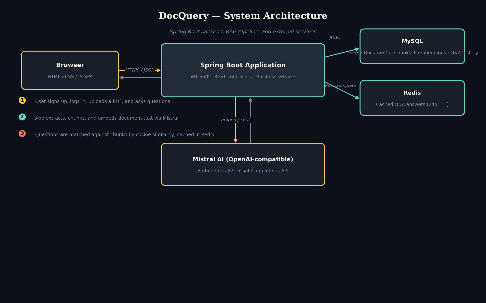
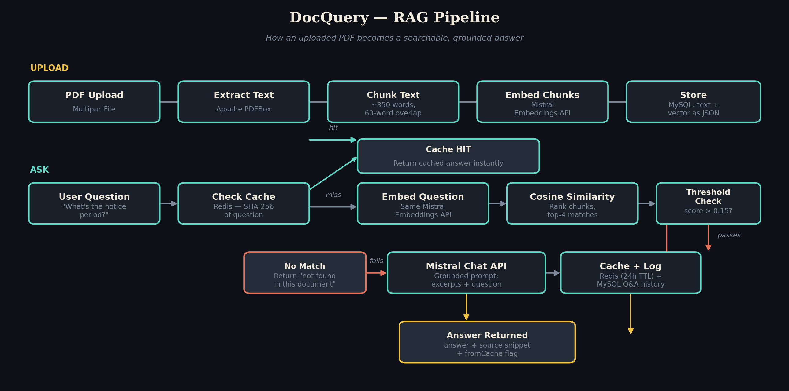

# DocQuery — AI-Powered Document Q&A API

Upload a PDF. Ask it questions in plain English. Get back an answer **and the exact passage it came from** — so you can verify it instead of blindly trusting it.

A Retrieval-Augmented Generation (RAG) system built with **Spring Boot 3, Spring Security (JWT), MySQL, Redis, and Apache PDFBox**, backed by Mistral AI's embeddings and chat models.

🔗 **Live demo:** [add your Render/Railway/Koyeb URL here]
📦 **Stack:** Java 17 · Spring Boot · MySQL · Redis · Docker

---

## Why this exists

Long documents — contracts, research papers, policy manuals, onboarding docs — bury the one fact you actually need. Keyword search fails the moment you don't know the exact phrasing used. DocQuery lets you ask in plain English and get a grounded, cited answer instead of skimming forty pages.

This is the same architectural pattern (RAG) behind production tools like internal knowledge-base search and legal-document assistants — built here end-to-end: auth, ingestion, retrieval, generation, and caching.

---

## Architecture



| Layer | Technology | Responsibility |
|---|---|---|
| Frontend | HTML / CSS / vanilla JS | Auth screens, upload UI, chat interface |
| API | Spring Boot 3, Spring Security | JWT auth, REST endpoints, validation |
| Database | MySQL 8 | Users, documents, chunks + embeddings, Q&A history |
| Cache | Redis | Repeated-question answers (24h TTL) |
| AI Provider | Mistral AI (OpenAI-compatible) | Text embeddings + chat completion |
| PDF Processing | Apache PDFBox | Text extraction from uploaded documents |

---

## How it works — the RAG pipeline



**Uploading a document:**
1. PDFBox extracts raw text from the uploaded file
2. Text is split into ~350-word chunks with 60-word overlap (so an answer that straddles a chunk boundary isn't lost)
3. Each chunk is embedded via Mistral's embeddings API
4. Chunks + their vectors are stored in MySQL

**Asking a question:**
1. Check Redis first — if this exact question was asked before, return the cached answer instantly, skipping both API calls entirely
2. On a cache miss, embed the question and compute cosine similarity against every chunk for that document
3. If the best match scores below a confidence threshold, return "not found in this document" instead of letting the model guess
4. Otherwise, send the top-matching excerpts + the question to Mistral's chat API, grounded by a system prompt that forbids answering outside the provided context
5. Cache the answer, log it to Q&A history, return it with the source passage

---

## Features

- **JWT authentication** — Spring Security, BCrypt password hashing, stateless sessions
- **Grounded answers** — the model is instructed to answer only from retrieved excerpts, and the API refuses to answer when nothing relevant is found, rather than hallucinating
- **Redis-backed caching** — repeated questions skip the LLM call entirely, cutting cost and latency
- **Document management** — upload, list, delete, with live processing status
- **Clean REST API** — documented below, testable with curl or Postman
- **Polished UI** — no build step required, plain HTML/CSS/JS, dark manuscript-inspired theme with markdown-rendered answers
- **Dockerized** — one command spins up the app, MySQL, and Redis together

---

## Tech stack

```
Backend:      Java 17, Spring Boot 3.2, Spring Security, Spring Data JPA, Spring Data Redis
Database:     MySQL 8 (Hibernate/JPA)
Cache:        Redis
Auth:         JWT (jjwt)
PDF parsing:  Apache PDFBox 3
AI provider:  Mistral AI (OpenAI-compatible embeddings + chat API)
Frontend:     HTML5, CSS3, vanilla JavaScript (no framework, no build step)
Container:    Docker, Docker Compose
```

---

## Project structure

```
docquery/
├── backend/
│   ├── pom.xml
│   ├── Dockerfile
│   ├── run-dev.ps1                  # one-command local dev runner (Windows)
│   └── src/main/
│       ├── java/com/docquery/
│       │   ├── config/              # Security + Redis configuration
│       │   ├── security/            # JWT util + filter
│       │   ├── model/               # JPA entities (User, Document, Chunk, QaHistory)
│       │   ├── repository/          # Spring Data repositories
│       │   ├── dto/                 # Request/response objects
│       │   ├── service/             # Business logic — the RAG pipeline lives here
│       │   ├── controller/          # REST endpoints
│       │   └── exception/           # Global error handling
│       └── resources/
│           ├── application.properties
│           └── static/              # Frontend (index.html, css/, js/)
├── docker-compose.yml
├── .env.example
└── README.md
```

---

## Getting started

### Prerequisites
- Java 17 (Lombok requires an LTS version — avoid bleeding-edge JDKs)
- Docker + Docker Compose
- A free Mistral AI API key — [console.mistral.ai](https://console.mistral.ai) (no credit card required)

### Run it

```bash
git clone https://github.com/YOUR-USERNAME/docquery.git
cd docquery
cp .env.example .env
# edit .env — paste your Mistral API key

docker compose up --build
```

Open **http://localhost:8080**, sign up, upload a PDF, ask it something.

### Running without Docker

```bash
cd backend
export DB_USER=root DB_PASSWORD=root OPENAI_API_KEY=your-key-here
mvn spring-boot:run
```

Requires a local MySQL and Redis instance — see `docker-compose.yml` for the exact versions expected.

---

## API reference

All `/api/**` routes except `/api/auth/**` require `Authorization: Bearer <token>`.

| Method | Endpoint | Description |
|---|---|---|
| POST | `/api/auth/register` | Create an account → returns JWT |
| POST | `/api/auth/login` | Authenticate → returns JWT |
| GET | `/api/documents` | List your documents |
| POST | `/api/documents/upload` | Upload a PDF (`multipart/form-data`, field `file`) |
| GET | `/api/documents/{id}` | Get one document's status |
| DELETE | `/api/documents/{id}` | Delete a document and its chunks |
| POST | `/api/documents/{id}/ask` | Ask a question → `{ answer, sourceSnippet, fromCache }` |

<details>
<summary><strong>curl examples</strong></summary>

```bash
# Register
curl -X POST http://localhost:8080/api/auth/register \
  -H "Content-Type: application/json" \
  -d '{"name":"Farhan","email":"farhan@example.com","password":"secret123"}'

# Upload (use the token from above)
curl -X POST http://localhost:8080/api/documents/upload \
  -H "Authorization: Bearer $TOKEN" \
  -F "file=@document.pdf"

# Ask
curl -X POST http://localhost:8080/api/documents/1/ask \
  -H "Authorization: Bearer $TOKEN" \
  -H "Content-Type: application/json" \
  -d '{"question":"What is the notice period for termination?"}'
```
</details>

---

## Key design decisions

**Why ~350-word chunks with overlap, not whole pages or single sentences?**
Whole pages dilute relevance and waste tokens; single sentences lose surrounding context. 350 words with a 60-word overlap keeps chunks topically coherent while ensuring an answer spanning a chunk boundary isn't lost.

**Why in-memory cosine similarity instead of a vector database?**
At this scale — a handful of documents, a few hundred chunks each — it's fast with zero extra infrastructure. `VectorSearchService` is isolated behind its own interface specifically so it could be swapped for pgvector, Pinecone, or Qdrant without touching the rest of the app if the dataset grew.

**Why cache at the question level rather than caching embeddings?**
The LLM call is the expensive, slow part. Caching the final answer skips both the embedding call *and* the LLM call on a repeat question — caching only embeddings would still leave the costlier LLM call on every request.

**Why does the app refuse to answer sometimes?**
A similarity threshold gates retrieval before the LLM is ever called. If nothing scores high enough, the API returns "not found in this document" instead of asking the model to answer anyway — the difference between a trustworthy tool and one that quietly hallucinates.

---

## Deployment

Deployed on [Render / Railway / Koyeb — pick whichever you used] with:
- App hosted as a Docker web service
- MySQL and Redis as managed add-ons
- Environment-variable-driven configuration (see `.env.example`) — no code changes needed to point at any MySQL/Redis provider

---

## What's next

- Swap in-memory cosine search for pgvector as document volume grows
- OCR support (Tesseract) for scanned PDFs
- Stream LLM responses token-by-token instead of waiting for the full answer
- Multi-document search ("ask across all my documents")
- Per-user rate limiting on `/ask` to control AI provider cost

---

## License

MIT — free to use, modify, and learn from.
