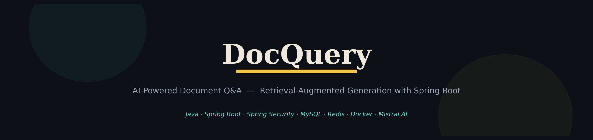
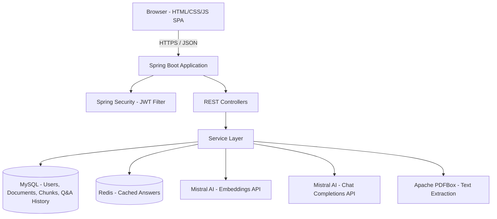
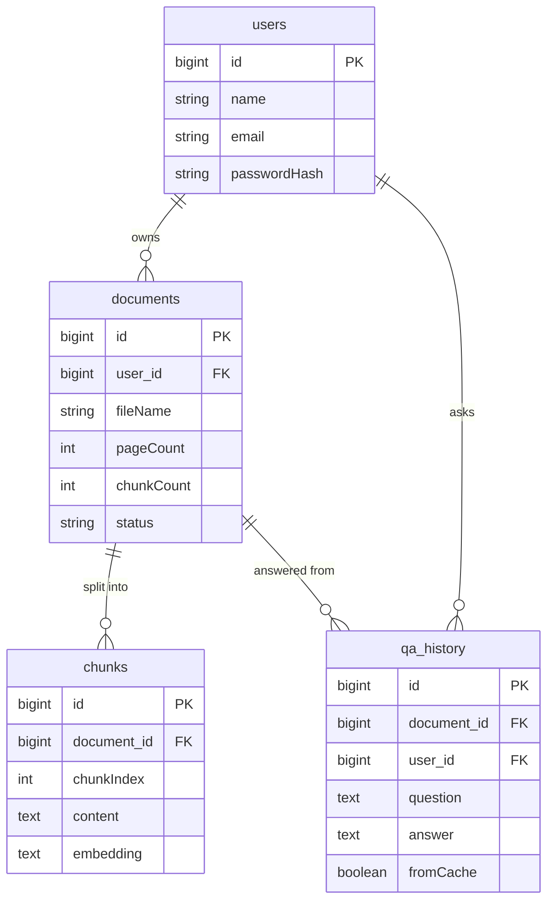

# 🔎 DocQuery - AI-Powered Document Q&A Platform

[](https://www.oracle.com/java/)
[](https://spring.io/projects/spring-boot)
[](https://www.mysql.com/)
[](https://redis.io/)
[](https://www.docker.com/)



## 🌟 Overview

**DocQuery** is a Retrieval-Augmented Generation (RAG) platform that lets you upload a PDF and ask it questions in plain English — and get back an answer **grounded in the actual document**, with the exact source passage shown alongside it. Built with Spring Boot and backed by Mistral AI, it turns static documents into something you can actually have a conversation with, instead of scrolling through forty pages hoping to find the one line you need.

### ✨ Key Features

🤖 **AI-Powered Retrieval**
- Retrieval-Augmented Generation pipeline grounded strictly in uploaded document content
- Cosine-similarity chunk retrieval before every LLM call
- Confidence-threshold gating — refuses to answer rather than hallucinating when nothing relevant is found
- Source-passage citation on every answer

📄 **Complete Document Management**
- PDF upload with automatic text extraction (Apache PDFBox)
- Overlapping chunking strategy (~350 words, 60-word overlap) to preserve context across boundaries
- Live processing status per document (Processing / Ready / Failed)
- One-click document deletion, cascading to associated chunks

💡 **Modern User Experience**
- Clean single-page chat interface, no build tooling required
- Markdown-rendered answers (bullet lists, bold key terms)
- Drag-and-drop upload with real-time status polling
- Responsive dark UI with a distinct manuscript-inspired visual identity

📊 **Q&A History & Caching**
- Every question and answer logged per document
- Redis-backed answer caching (24h TTL) — repeated questions skip both the embedding and LLM calls entirely
- Cache-hit indicator shown directly in the UI

🔒 **Enterprise-Grade Security**
- Stateless JWT authentication via Spring Security
- BCrypt password hashing
- Per-user document isolation — no cross-account data access
- CORS and request validation on every endpoint

---

## 🏗️ Architecture



---

## 🚀 Technology Stack

### Backend
- **Language:** Java 17
- **Framework:** Spring Boot 3.2 (Web, Validation)
- **Security:** Spring Security with stateless JWT (jjwt)
- **Persistence:** Spring Data JPA + Hibernate
- **Caching:** Spring Data Redis

### Database & Cache
- **Primary store:** MySQL 8.0 with connection pooling (HikariCP)
- **Cache layer:** Redis 7 — answer caching with 24h TTL

### AI & Machine Learning
- **LLM Provider:** Mistral AI (OpenAI-compatible API)
- **Embeddings:** `mistral-embed`
- **Chat/Generation:** `mistral-small-latest`
- **Retrieval:** In-memory cosine similarity ranking over stored chunk vectors

### DevOps & Infrastructure
- **Containerization:** Docker, multi-stage build
- **Orchestration:** Docker Compose (app + MySQL + Redis)
- **PDF Processing:** Apache PDFBox 3
- **Build Tool:** Maven

---

## 📋 Prerequisites

Before you begin, ensure you have the following installed:

- **Java** 17 or higher (JDK, not just JRE)
- **Maven** 3.9 or higher
- **Docker** and **Docker Compose**
- **Git** for version control
- A free **Mistral AI** API key — [console.mistral.ai](https://console.mistral.ai) (no credit card required)

---

## ⚡ Quick Start

### 1. Clone the Repository

```bash
git clone https://github.com/farhanAhmed113/docquery.git
cd docquery
```

### 2. Environment Configuration

Copy the example environment file and fill in your values:

```bash
cp .env.example .env
```

```env
# Database
DB_NAME=docquery
DB_PASSWORD=root

# JWT
JWT_SECRET=your-long-random-32-plus-character-secret

# AI Provider (Mistral — free, no credit card)
OPENAI_API_KEY=your_mistral_api_key_here
OPENAI_EMBEDDING_MODEL=mistral-embed
OPENAI_CHAT_MODEL=mistral-small-latest
OPENAI_BASE_URL=https://api.mistral.ai/v1
```

### 3. Start with Docker Compose

```bash
docker compose up --build
```

This starts the Spring Boot app, MySQL, and Redis together in one command.

### 4. Access the Application

The application will be available at:

- **App:** <https://docquery-0sut.onrender.com>

Sign up, upload a PDF, and start asking questions.

---

## 📖 API Documentation

### Authentication Endpoints

| Method | Endpoint | Description |
|--------|----------|-------------|
| POST | `/api/auth/register` | Register a new user account |
| POST | `/api/auth/login` | Authenticate and receive a JWT |

### Document Endpoints

| Method | Endpoint | Description |
|--------|----------|-------------|
| GET | `/api/documents` | Get all documents for the authenticated user |
| POST | `/api/documents/upload` | Upload a PDF (`multipart/form-data`) |
| GET | `/api/documents/{id}` | Get a single document's status |
| DELETE | `/api/documents/{id}` | Delete a document and its chunks |

### AI-Powered Q&A Endpoints

| Method | Endpoint | Description |
|--------|----------|-------------|
| POST | `/api/documents/{id}/ask` | Ask a question, grounded in that document |

### Example API Requests

#### Register a User

```bash
curl -X POST "http://localhost:8080/api/auth/register" \
  -H "Content-Type: application/json" \
  -d '{"name":"Farhan","email":"farhan@example.com","password":"secret123"}'
```

#### Ask a Grounded Question

```bash
curl -X POST "http://localhost:8080/api/documents/1/ask" \
  -H "Authorization: Bearer $TOKEN" \
  -H "Content-Type: application/json" \
  -d '{"question":"What is the notice period for termination?"}'
```

---

## 🗄️ Database Schema

### Core Tables

- **users** — Account credentials and profile info
- **documents** — Uploaded PDFs, owner, processing status
- **chunks** — Chunked document text + serialized embedding vectors
- **qa_history** — Every question asked, its answer, source snippet, and cache status

**📊 Database ERD**



---

## 🔧 Configuration

### Environment Variables

| Variable | Description | Default |
|----------|-------------|---------|
| `DB_HOST` | MySQL host | localhost |
| `DB_PORT` | MySQL port | 3306 |
| `DB_NAME` | Database name | docquery |
| `DB_USER` | Database username | root |
| `DB_PASSWORD` | Database password | root |
| `REDIS_HOST` | Redis host | localhost |
| `REDIS_PORT` | Redis port | 6379 |
| `JWT_SECRET` | Secret key for signing JWTs | — |
| `OPENAI_API_KEY` | Mistral AI API key | — |
| `OPENAI_EMBEDDING_MODEL` | Embedding model name | mistral-embed |
| `OPENAI_CHAT_MODEL` | Chat/generation model name | mistral-small-latest |
| `OPENAI_BASE_URL` | OpenAI-compatible API base URL | https://api.mistral.ai/v1 |

### Custom Configuration

The platform supports tuning through `application.properties`:

- Chunk size and overlap: `app.chunk.size-words`, `app.chunk.overlap-words`
- Retrieval depth: `app.retrieval.top-k`
- Connection pool size: `spring.datasource.hikari.maximum-pool-size`

---

## 🚀 Deployment

### Production Build

```bash
cd backend
mvn clean package -DskipTests
java -jar target/docquery.jar
```

### Docker Deployment

```dockerfile
FROM maven:3.9-eclipse-temurin-17 AS build
WORKDIR /app
COPY pom.xml .
RUN mvn -B dependency:go-offline
COPY src ./src
RUN mvn -B clean package -DskipTests

FROM eclipse-temurin:17-jre-alpine
WORKDIR /app
COPY --from=build /app/target/docquery.jar app.jar
EXPOSE 8080
ENTRYPOINT ["java", "-jar", "app.jar"]
```

### Environment Setup for Production

1. Provision a MySQL database (managed or self-hosted)
2. Provision a Redis instance
3. Set all environment variables listed above
4. Deploy the Docker image to your platform of choice
5. Point `DB_HOST`, `REDIS_HOST`, and related variables at your production services

🔗 **Live demo:** [https://docquery-0sut.onrender.com]

---

## 📊 Performance Features

- **Answer caching** — Redis-backed, 24h TTL, skips both embedding and LLM calls on repeat questions
- **Connection pooling** — HikariCP-managed MySQL connections, tuned for deployment target
- **Chunked retrieval** — only relevant excerpts sent to the LLM, not the full document, on every request
- **Lazy JPA associations** — documents and chunks fetched only when needed

## 🔐 Security Features

- **Stateless JWT authentication** — no server-side session storage
- **BCrypt password hashing** — industry-standard, salted
- **Per-user data isolation** — every document and query scoped to its owner
- **Input validation** — `jakarta.validation` on all request DTOs
- **CORS configuration** — explicit allowed origins/methods

## 🧪 Testing

```bash
cd backend
mvn test
```

*(Test suite scaffolding included via `spring-boot-starter-test`; expand with unit tests for `QueryService` and `VectorSearchService` as the project grows.)*

## 📈 Analytics & Monitoring

DocQuery logs every interaction for future analysis:

- **Q&A History** — every question, answer, and whether it was served from cache
- **Document Processing Status** — track success/failure per upload
- **Cache Hit Rate** — visible per-answer in the UI (`fromCache` flag)

---

## 🛠️ Development

### Project Structure

```
docquery/
├── backend/
│   ├── src/main/java/com/docquery/
│   │   ├── config/          # Security + Redis configuration
│   │   ├── security/        # JWT utility + filter
│   │   ├── model/            # JPA entities
│   │   ├── repository/       # Spring Data repositories
│   │   ├── dto/               # Request/response objects
│   │   ├── service/           # RAG pipeline + business logic
│   │   ├── controller/        # REST endpoints
│   │   └── exception/         # Global error handling
│   └── src/main/resources/
│       ├── application.properties
│       └── static/            # Frontend (HTML/CSS/JS)
├── docker-compose.yml
├── .env.example
└── README.md
```

### Adding New Features

1. **Database Changes** — add/update JPA entities in `model/`, let Hibernate handle DDL via `spring.jpa.hibernate.ddl-auto=update`
2. **Repositories** — extend `JpaRepository` in `repository/`
3. **Business Logic** — implement in `service/`, keep controllers thin
4. **API Routes** — add endpoints in `controller/`
5. **Frontend** — extend `static/js/app.js` and `static/css/style.css`

---

## 🤝 Contributing

Contributions are welcome! Please follow these steps:

1. Fork the repository
2. Create a feature branch (`git checkout -b feature/your-feature`)
3. Make your changes
4. Add tests if applicable
5. Submit a pull request

## 📄 License

This project is licensed under the MIT License — see the [LICENSE](LICENSE) file for details.

## 🙏 Acknowledgments

- **Mistral AI** — for accessible, free-tier embeddings and chat completion APIs
- **Spring Boot Community** — for extensive documentation and tooling
- **Open Source Contributors** — Apache PDFBox, jjwt, and the broader Java ecosystem

## 📞 Support

For support and questions:

- **Issues** — open a GitHub issue for bugs or feature requests
- **Discussions** — use GitHub Discussions for questions
- **Documentation** — see the API reference and architecture sections above

---

**Built as a hands-on exploration of Retrieval-Augmented Generation, from PDF ingestion to grounded answers.**
